# TinyClient

  

Http client implementation for microcontrollers

## Setup
1. Efter build, skal der laves et fix i JSON Bourne. 
  `.pio/libdeps/esp32/bourne/src/bourne/detail/parser.cpp`
  `.pio/libdeps/esp32/bourne/src/bourne/json.cpp`
  `#define _GLIBCXX_USE_C99 1`

#### Brought to you by: Førsteholdet

  

